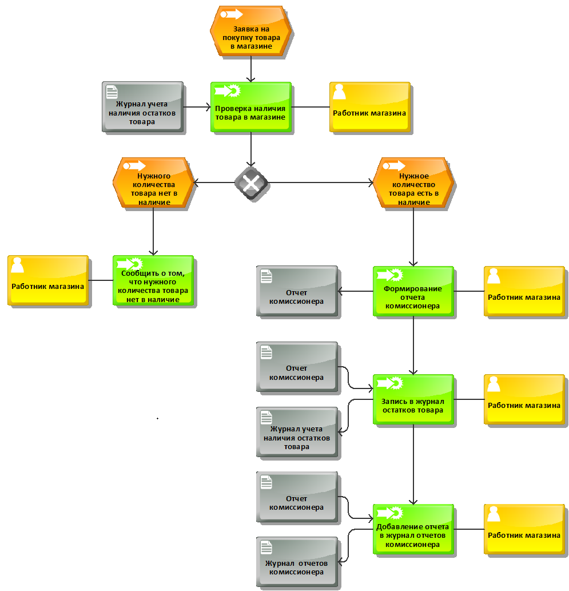
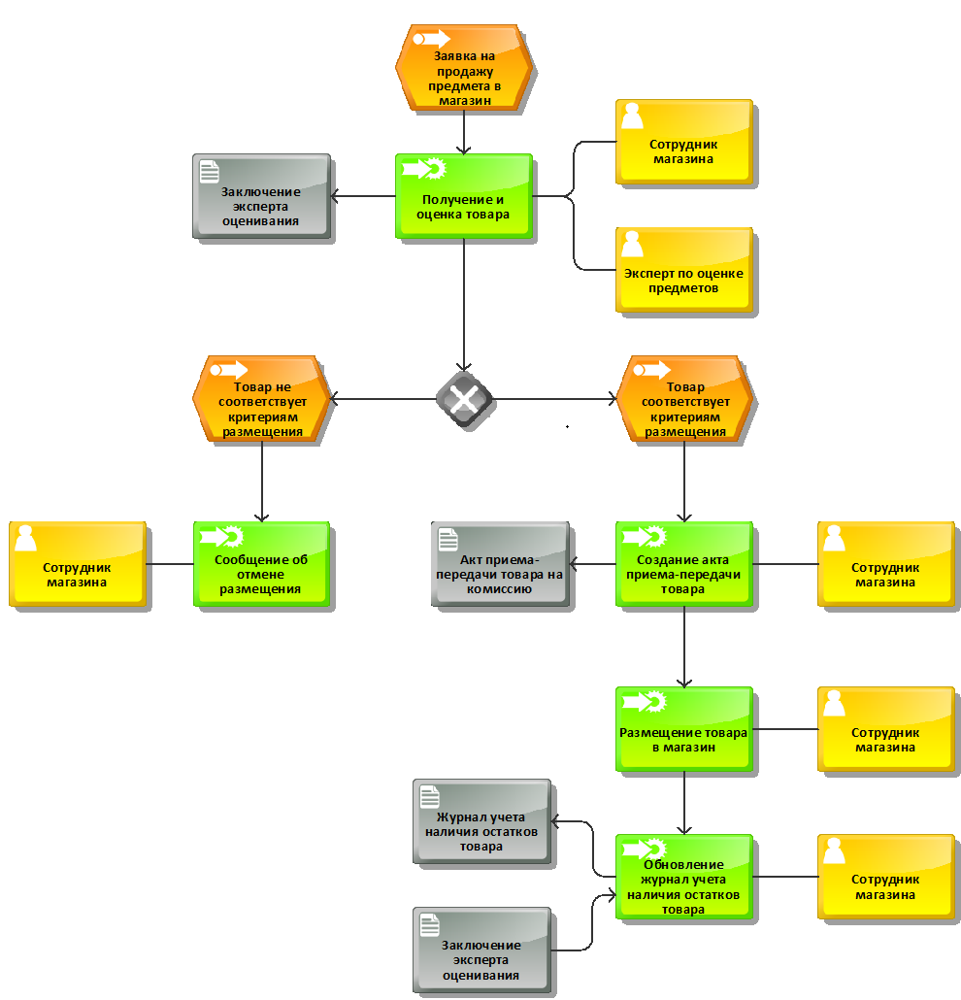
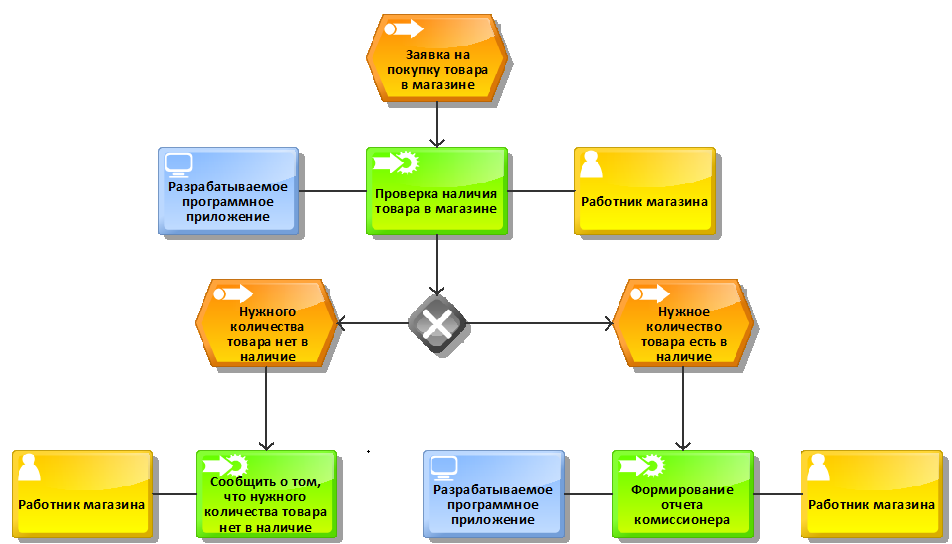
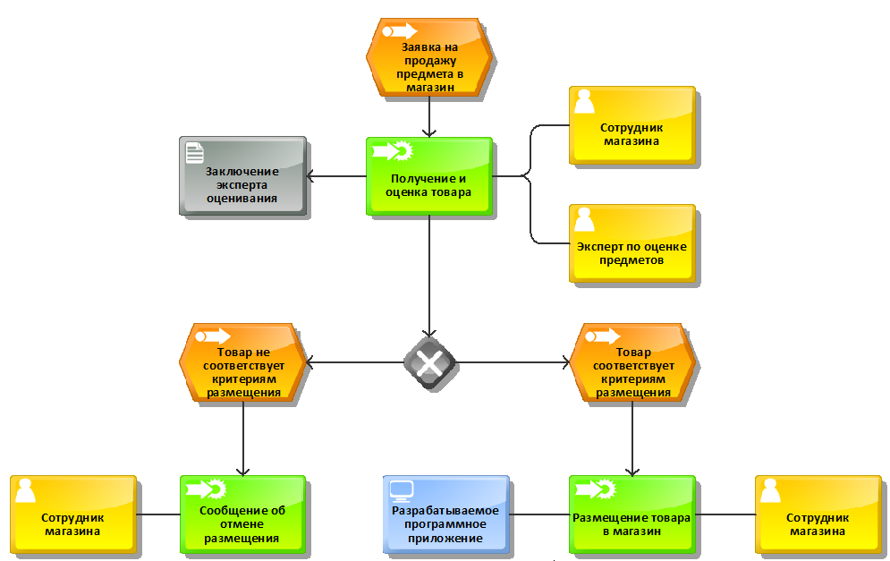
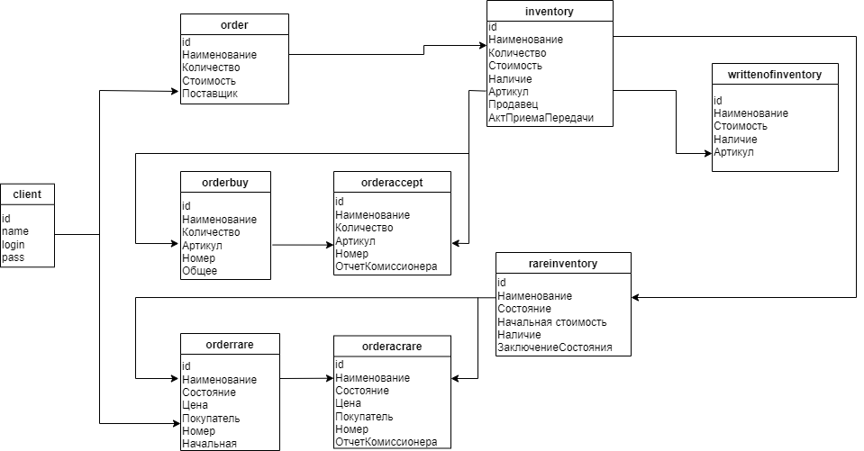

# Реализация программного приложения для ведения учета товаров в антикварном магазине

При создании программного средства была использованы: среда разработки Visual Studio 2022 с использованием Windows Forms,
язык программирования C# и система управления базами данных MySql. 
В процессе разработки были пройдены все необходимые этапы от необходимости создания программного обеспечения
и выявления требований до реализации и тестирования программного приложения.

## Проектирование бизнес-процессов

Для выполнения анализа процесса ведения учета товаров в антикварном магазине была разработана диаграмма «AS-IS»
по методологии ARIS EPC с помощью case-средства Aris Express.

### Схемы бизнес-процессов AS-IS

Диаграмма процесса продажи товара

Диаграмма процесса пополнения товара

### Схемы бизнес-процессов TO-BE

Диаграмма процесса продажи товара

Диаграмма процесса пополнения товара

## UML Class диаграмма базы данных

